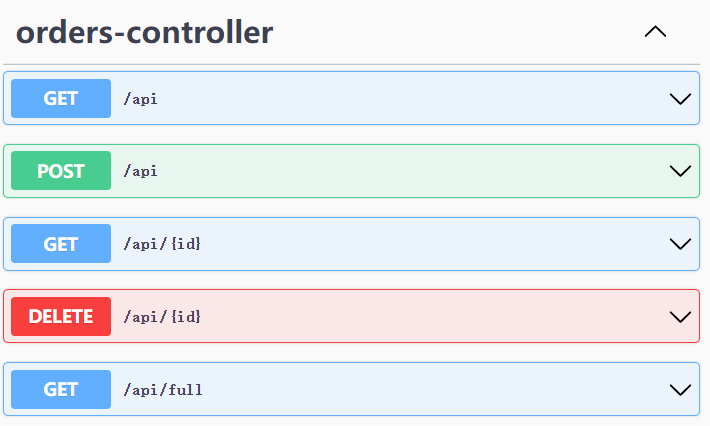

# aw10-final

使用 Spring WebFlux 技术栈实现整个项目（包括网关，商品服务，购物车服务，订单服务，配送服务），具体有以下内容。

- 使用 spring-boot-starter-webflux 实现 RESTful API 控制器
- 使用 springdoc-openapi-webflux-ui 实现 OpenAPI 文档
- 使用 spring-boot-starter-data-mongodb-reactive 实现响应式 MongoDB 数据库访问
- 使用 spring-integration-webflux 实现集成

基于以下基础设施构建整个系统：

- 由于 Netlify Eureka 进入维护模式，改用 Nacos 作为服务注册中心
- 使用 spring-cloud-gateway 作为网关
- 使用 spring-cloud-loadbalancer 作为负载均衡器
- 使用 spring-cloud-openfeign 作为服务消费者
- 使用 MongoDB 作为响应式数据库
- 使用 RabbitMQ 作为消息队列，配合 spring-bus 消息总线实现异步消息传递

各服务的 RESTful API 如下。部分服务的数据更新是在内部完成的，故没有公开对应接口。





每个服务采用分层架构，都具有自己的数据库，仓库，控制器。示例代码如下：

```java
// DB
public interface DeliveryDb extends ReactiveMongoRepository<Delivery, String> {}

// Repository
@Override
public Mono<Delivery> update(Delivery item) {
    return Mono.just(item).filterWhen(x -> db.existsById(x.getId())).flatMap(x -> db.save(x));
}

// Controller
@GetMapping("/{id}")
public Mono<Delivery> get(@PathVariable String id) throws DeliveryNotFoundException {
    return repository.get(id).switchIfEmpty(Mono.error(new DeliveryNotFoundException()));
}
```

最终服务被打包成 Docker 镜像，从而方便进行水平扩展，开启多个实例，使用 `SERVER_PORT` 环境变量即可修改每个实例的端口号。

```sh
# Run
gradle bootRun

# Build Image
gradle bootBuildImage
```

系统依赖的外部服务，如 MongoDb，RabbitMQ 等，也使用容器进行部署。

```yaml
mq:
  image: rabbitmq:3-management
  ports:
    - "10510:5672"
    - "10511:15672"
  environment:
    - RABBITMQ_DEFAULT_USER=guest
    - RABBITMQ_DEFAULT_PASS=guest
```

从而整个项目能够运行在容器平台，具有较高的弹性和可移植性。

各服务均启动单实例时，服务注册中心的监测状态如下图。


综上，本项目使用如下设计思路和开发方式满足响应式架构的四个要求。

- Responsive：使用响应式技术栈从数据库层次到 RESTful 接口层次，提高系统吞吐率。
- Resilient：服务内部使用 Project Reactor 提供的接口处理错误。服务注册中心则监测各实例状态，如果有实例失败，则下线该实例，使用其他实例处理。
- Elastic：各服务构建了镜像，使用镜像创建容器从而能够弹性部署
- Message Driven：不同服务间使用RESTful API 和 消息队列通信。

## Description

Please develop a **fully functional** online purchase order system.

- It should have a superb collection of goods merchandises
- Customer can browse/search for merchandises, add selected one into his shopping cart and checkout to complete a transaction.
- User can get delivery status updates continuously.

The system should be of a **reactive architecture**, which means it should be 

-  Responsive: it should response to the user request timely.
-  Resilient: it should not be easily broken down.
-  Elastic: it should be flexible to scale out.
-  Message Driven: it should has loosely coupled components that communicates with each other asynchronously.


Please design tests/experiements to demostrate that your system fulfills such requirements as stated in [The Reactive Manifesto](https://www.reactivemanifesto.org)

**Submit your codes/documents/tests/experiements of your system.**
